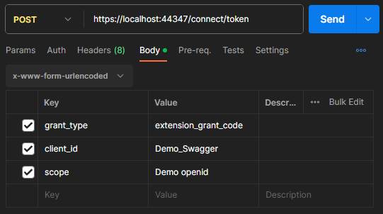

## About this solution

This is a minimalist, non-layered startup solution with the ABP Framework. All the fundamental ABP modules are already installed.

## How to run

The application needs to connect to a database. Run the following command in the `OpenIddict.Demo` directory:

````bash
dotnet run --migrate-database
````

This will create and seed the initial database. Then you can run the application with any IDE that supports .NET.

Use Postman software to verify custom grant:

- Request method: Post
- Request address: https://localhost:44347/connect/token
- Request body type: x-www-form-urlencoded
  - grant_type:extension_grant_code
  - client_id:Demo_Swagger
  - scope:Demo openid

Returns access_token data after performing a send.



Happy coding..!
